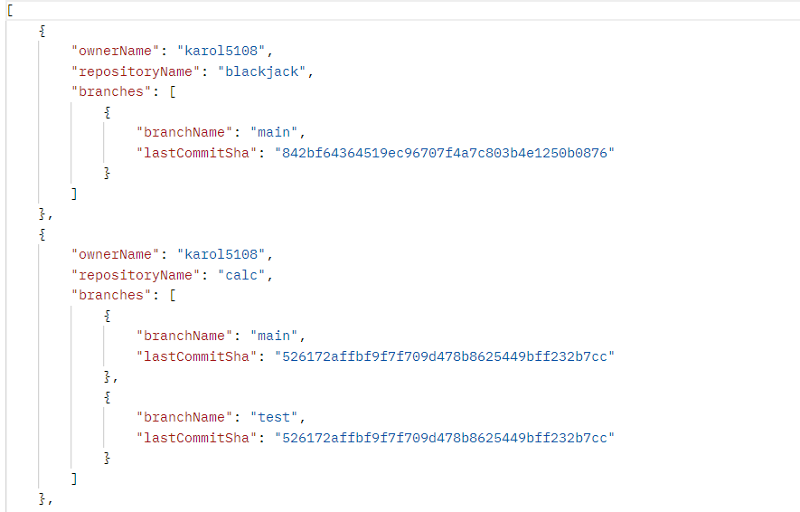
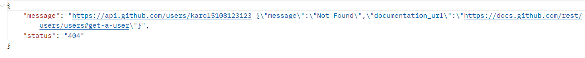

# Simple Java Spring Boot Api Listing Git Repositories
This application listing all repositories which are not forks for a given user, including information about all branches and thier last commit SHA. In addition to this api handling 404 not found error and providing response in JSON.

## Recruiments:
- Java 8 or higher
- GitHub API
- GitHub access token
- Lombok

## List User Repositories

## 404 not found

